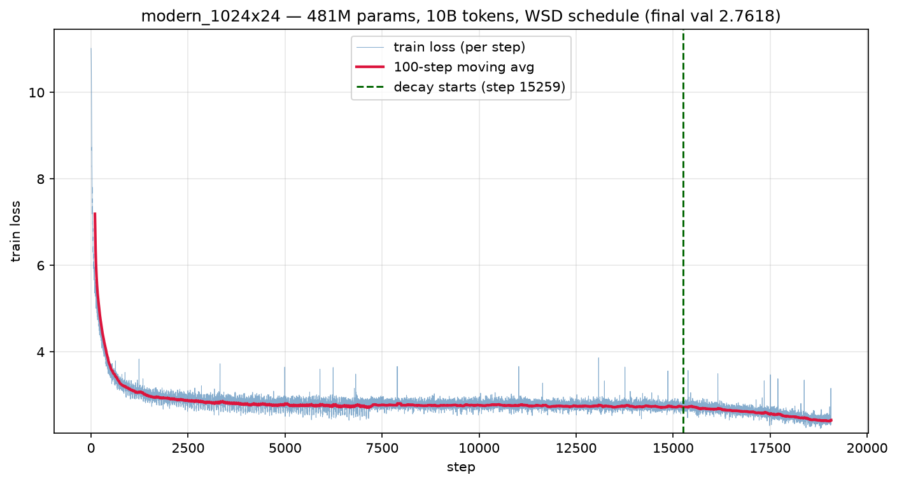
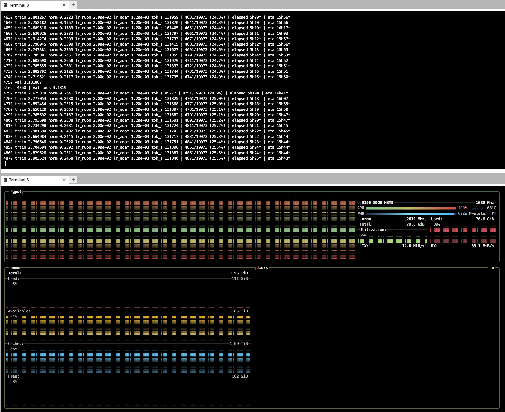
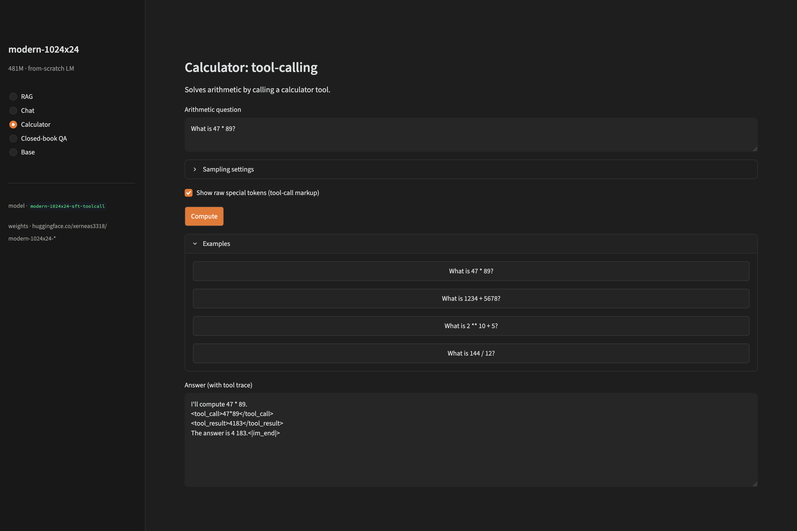
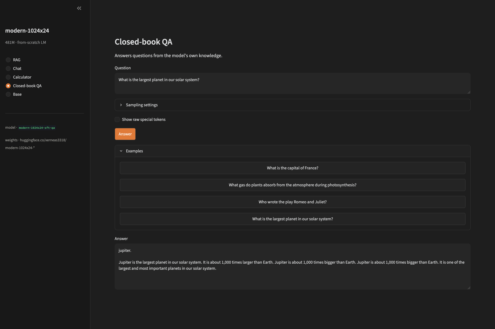

<div align="center">

# modern-lm

**A 481M-parameter language model built from scratch, one modern component at a time.**

[Models on Hugging Face](https://huggingface.co/xerneas3318) · [What went into it](#what-went-into-it) · [Sample outputs](#sample-outputs) · [Try it](#try-it)


</div>

<details>
<summary><b>Table of contents</b></summary>

- [About](#about)
- [What went into it](#what-went-into-it)
- [Architecture](#architecture)
- [Training](#training)
- [The models](#the-models)
- [Sample outputs](#sample-outputs)
- [Post-training](#post-training)
- [Try it](#try-it)
- [What I learned](#what-i-learned)
- [How this was built](#how-this-was-built)
- [Resources](#resources)
- [Acknowledgments](#acknowledgments)
- [License](#license)

</details>

## About

This project picks up where my earlier repo, **[zero-to-gpt2](https://github.com/xerneas3318/zero-to-gpt2)**, left off. That one was my run through Karpathy's *Neural Networks: Zero to Hero*, rebuilding GPT-2 by hand to understand every line. It ends with a working but 2019-era model.

I wanted to go further. I read through a stack of papers, tech reports, and speedrun writeups on what separates a modern model from GPT-2, picked the parts that looked most promising, implemented each one from scratch, and cobbled them together into a single ~481M model. Then I trained it on 10B tokens and post-trained the base into an assistant.

None of the ideas are mine. The work was reading each one, implementing it without copying a reference, checking that it actually helped, and getting all of them to cooperate in one clean codebase (`model.py`), then training the whole thing end to end.

It is a small model. The format and behavior are real; the world knowledge is limited. That tradeoff is the point of building it yourself.

## What went into it

These are the ideas I pulled in and stitched together, with the paper or writeup I worked from for each. All of them live in `model.py`.

| Component | What it does | Source |
|-----------|--------------|--------|
| RMSNorm, no biases | Normalize by RMS only, drop every bias | [Zhang & Sennrich 2019](https://arxiv.org/abs/1910.07467) |
| RoPE | Rotate query/key pairs by position | [Su et al. 2021 (RoFormer)](https://arxiv.org/abs/2104.09864) |
| SwiGLU FFN | Gated feed-forward with three matrices | [Shazeer 2020 (GLU Variants)](https://arxiv.org/abs/2002.05202) |
| Untied embeddings + zero-init | Separate input/output embeddings, zero-init residual writers | [Press & Wolf 2016](https://arxiv.org/abs/1608.05859) (tying background); zero-init from [modded-nanogpt](https://github.com/KellerJordan/modded-nanogpt) |
| QK-norm | Per-head RMSNorm on queries and keys | [Henry et al. 2020](https://arxiv.org/abs/2010.04245), at scale in [ViT-22B](https://arxiv.org/abs/2302.05442) |
| FlashAttention (via SDPA) | Fused, memory-efficient attention | [Dao et al. 2022](https://arxiv.org/abs/2205.14135), [FlashAttention-2](https://arxiv.org/abs/2307.08691) |
| Muon optimizer | Orthogonalize the momentum-averaged gradient on the 2D matrices | [Keller Jordan's Muon writeup](https://kellerjordan.github.io/posts/muon/) + [modded-nanogpt](https://github.com/KellerJordan/modded-nanogpt) |
| WSD learning-rate schedule | Warmup, stable, then decay | [MiniCPM, Hu et al. 2024](https://arxiv.org/abs/2404.06395) |
| GQA | 16 query heads share 4 KV heads | [Ainslie et al. 2023](https://arxiv.org/abs/2305.13245) |
| Value embeddings | A second embedding table mixed into V by learned scalars | [modded-nanogpt](https://github.com/KellerJordan/modded-nanogpt) speedrun + [Field Guide](https://evanjayconway.com/posts/2026/nanogpt-improvements/) |
| U-net skips | Skip connections between mirrored layer halves | same speedrun writeups |
| Logit softcap | `15 * tanh(logits / 15)` on the head | [Gemma 2 tech report](https://arxiv.org/abs/2408.00118) |

To make Muon work, the optimizer is split: **Muon** runs on the 2D hidden weight matrices, and **AdamW** handles the embeddings, the LM head, and the norm/scalar parameters (the embeddings are excluded from Muon by identity).

I also read about [MLA (DeepSeek-V2)](https://arxiv.org/abs/2405.04434), MuonClip / QK-clip (Kimi K2 tech report), and Engram, but left them out of this model.

## Architecture

|  |  |
|---|---|
| Parameters | 480.9M |
| Layers | 24 |
| Model dim | 1024 |
| Heads | 16 query, 4 KV (GQA) |
| Context | 2048 |
| Vocab | 50304 (GPT-2 BPE, padded from 50257) |
| Precision | bf16 autocast |

The padded vocab reserves special tokens for post-training that never appear during pretraining: `<|im_start|>`, `<|im_end|>`, `<pad>`, `<think>`, `</think>`, `<tool_call>`, `</tool_call>`, `<tool_result>`, `</tool_result>`.

## Training

- **Data:** FineWeb-Edu `sample-10BT` (82%) mixed with `codeparrot-clean` Python (18%), tokenized with the GPT-2 BPE into `uint16` shards. About 10.0B tokens total.
- **Schedule:** WSD. 3% warmup, a long stable phase at max learning rate (Muon 0.02, AdamW 1.2e-3), then a linear decay to zero.
- **Batch:** a fixed 524,288 tokens per optimizer step (micro-batch 16 at sequence length 2048, with gradient accumulation), so the dynamics are constant regardless of the card.
- **Hardware:** one H100 80GB, about 131k tokens/sec sustained, roughly 21 hours.
- **Result:** validation loss from 11.03 at init down to **2.7618**.

<div align="center">
  
  <br>
  <em>Training loss across the full run. Note how the final decay phase (right) delivers the largest drop.</em>
</div>

<div align="center">
  
  <br>
  <em>The run in progress: train loss, learning rates, and ~131k tokens/sec, with the H100 pinned at 99 to 100 percent.</em>
</div>

## The models

Every model comes from the same pretraining run. The four post-trained variants branch off the instruction-tuned base.

| Model | From | What it does |
|-------|------|--------------|
| [modern-1024x24-base](https://huggingface.co/xerneas3318/modern-1024x24-base) | pretrain | Final base, val loss 2.7618 |
| [modern-1024x24-base-stable](https://huggingface.co/xerneas3318/modern-1024x24-base-stable) | pretrain | End of the WSD stable phase (before decay) |
| [modern-1024x24-sft](https://huggingface.co/xerneas3318/modern-1024x24-sft) | base | Chat assistant + light tool use |
| [modern-1024x24-sft-toolcall](https://huggingface.co/xerneas3318/modern-1024x24-sft-toolcall) | sft | Calculator tool-calling specialist |
| [modern-1024x24-sft-qa](https://huggingface.co/xerneas3318/modern-1024x24-sft-qa) | sft | Closed-book question answering |
| [modern-1024x24-sft-rag](https://huggingface.co/xerneas3318/modern-1024x24-sft-rag) | sft | Grounded QA, answers only from provided context |

## Sample outputs

All generated locally from the published weights. These are favorable examples; a 481M model is fluent but not always correct.

### Base (raw completion)

```
Prompt: The three primary colors are
Output: The three primary colors are red, yellow and blue. These are the most basic
        color shades, and they are determined by how intense or faint they are.
```

```
Prompt: def is_prime(n):
Output: def is_prime(n):
            """
            Return True iff n is a prime number.
            >>> is_prime(3)
            True
            """
```

### SFT (chat)

```
Q: Give me three tips for staying focused while studying.
A: 1. Establish a routine: Set a regular routine for your study schedule to maintain
      consistency and stay focused.
   2. Use a study app: Keep track of your progress, set goals, and stay organized.
   3. Stay connected: Reach out to friends, family, or colleagues for support and
      encouragement to help you stay motivated.
```

### Tool-calling

The model writes the call, a real calculator evaluates it (arithmetic only, no code execution), and the result is fed back.

```
Q: What is 25 * 4?
A: I'll compute 25 * 4.
   <tool_call>25*4</tool_call>
   <tool_result>100</tool_result>
   The answer is 100.
```

### Closed-book QA

```
Q: What is the capital of France?                          A: Paris.
Q: What gas do plants absorb during photosynthesis?        A: Carbon dioxide.
Q: What is the chemical symbol for water?                  A: H2O.
```

### RAG (grounded QA)

Given a short context about the Eiffel Tower:

```
Q: Who designed the Eiffel Tower?     A: Gustave Eiffel
Q: When was it completed?             A: 1889
Q: What is the population of Brazil?   (not in context)   A: I don't know.
```

The abstention is the interesting part: trained on a mix that includes unanswerable questions, the RAG model learns to say "I don't know" rather than hallucinate when the answer is not in the context.

## Post-training

The base model is a next-token predictor, not an assistant. Turning it into one is supervised fine-tuning (`sft.py`) on the same network with new data and a masked objective:

- Conversations are formatted as ChatML, and the loss is **masked to the assistant's tokens only**, so the model learns to answer and to stop, not to echo the prompt.
- Synthetic arithmetic **tool-call** examples are mixed in, with the injected tool result masked out so the model learns to *write the call and use the result* rather than fabricate it.
- The chat model was then branched into the tool-call, closed-book QA, and RAG specialists, each a short fine-tune on its own data.

The tokenizer, calculator, and inference loop live in `toolcall.py`. The calculator is a strict arithmetic evaluator (it rejects names, calls, and imports), so it is a calculator, never code execution.

For the recipe I leaned on [nanochat](https://github.com/karpathy/nanochat) and [TRL](https://github.com/huggingface/trl). The obvious next steps I have not done yet are preference tuning with [DPO](https://arxiv.org/abs/2305.18290) and RL with verifiable rewards ([open-r1](https://github.com/huggingface/open-r1)).

## Try it

A Streamlit playground (`app.py`) wraps all five models behind a sidebar: chat, calculator, closed-book QA, RAG with your own uploaded context, and raw base completion.

<div align="center">
<table>
<tr>
<td></td>
<td></td>
</tr>
<tr>
<td align="center"><em>Calculator: the model writes a tool call, a calculator runs it, the result is fed back</em></td>
<td align="center"><em>Closed-book QA</em></td>
</tr>
</table>
</div>

```bash
uv sync
uv run streamlit run app.py
```

Or load a model directly:

```python
import torch
from model import GPT, GPT2Config, build_enc

ckpt = torch.load("model.pt", map_location="cpu", weights_only=False)
model = GPT(GPT2Config(**ckpt["config"]))
model.load_state_dict(ckpt["model"])
model.eval()
enc = build_enc()
```

## What I learned

- Most of these ideas are small, independent wins that compound. Muon and the WSD decay phase moved the loss the most.
- Most of a base model's usefulness is unlocked in post-training, but post-training cannot add knowledge the base does not have. At 481M / 10B tokens the format is reliable and the facts are not.
- A low loss is not proof a model works. The RAG model once reached the lowest loss of any stage by learning to always say "I don't know," which is exactly why I test with questions whose answers I know.
- Implementing each idea by hand instead of importing it, then diffing against a reference, taught me far more than reading the papers would have.

## How this was built

The majority of the logic here is mine. My workflow was to implement each model and logic change by hand, from scratch, in `gpt.ipynb`, working out the architecture myself, and then convert that notebook into the headless `train.py` training script with AI assistance. The tool-calling loop (`toolcall.py`) and the data-formatting and SFT scripts were also written with AI help.

So the architecture choices, the from-scratch implementations in the notebook, and the decisions about what to try are mine. The AI mostly turned my notebook code into runnable scripts and handled the surrounding plumbing.

## Resources

The explainers that carried this project, worth reading in roughly this order:

- [Raschka: The Big LLM Architecture Comparison](https://magazine.sebastianraschka.com/p/the-big-llm-architecture-comparison): what modern models actually use and why.
- [Raschka: GPT to Llama conversion notebooks](https://github.com/rasbt/LLMs-from-scratch/tree/main/ch05/07_gpt_to_llama): the answer key for the first few pieces (RMSNorm, RoPE, SwiGLU).
- [Umar Jamil: LLaMA explained](https://www.youtube.com/watch?v=Mn_9W1nCFLo) and [Coding LLaMA 2 from scratch](https://www.youtube.com/watch?v=oM4VmoabDAI): the best video walkthroughs of RMSNorm, RoPE, GQA, SwiGLU.
- [A Field Guide to NanoGPT Speedrun Optimizations](https://evanjayconway.com/posts/2026/nanogpt-improvements/): every speedrun trick cataloged.
- [modded-nanogpt](https://github.com/KellerJordan/modded-nanogpt): the record history is a curriculum by itself, and the home of Muon.
- [nanochat](https://github.com/karpathy/nanochat): Karpathy's modern reference.

## Acknowledgments

This started from **[zero-to-gpt2](https://github.com/xerneas3318/zero-to-gpt2)**, my earlier from-scratch GPT-2 build, which itself follows Andrej Karpathy's *Neural Networks: Zero to Hero* and nanoGPT. Muon comes from Keller Jordan and the modded-nanogpt speedrun community. The architecture survey and conversion notebooks are Sebastian Raschka's, and the clearest video explanations are Umar Jamil's. Thank you to all of them for making this learnable in the open.

## License

MIT.
